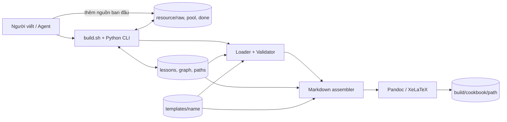
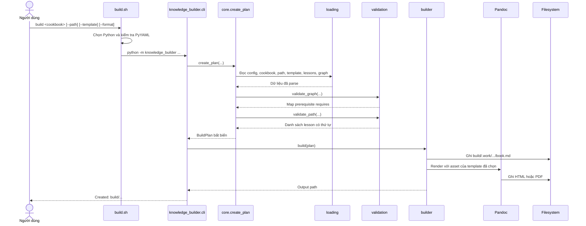
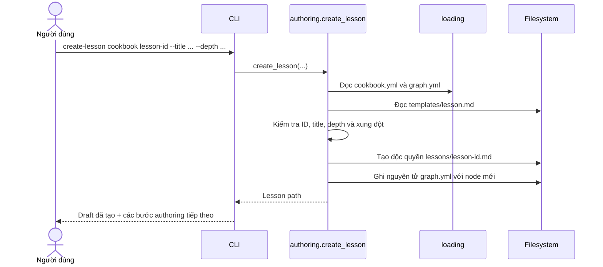

# Kiến trúc Knowledge Lesson Builder

Tài liệu này mô tả kiến trúc đang chạy trong repository, không phải kiến trúc
mục tiêu trong tương lai. Phần cuối ghi lại các vấn đề đã quan sát và thứ tự cải
tiến đề xuất để hệ thống tiếp tục nhỏ, dễ kiểm soát.

## 1. Mục tiêu và ranh giới

Knowledge Lesson Builder biến các lesson Markdown độc lập thành workbook theo
một learning path được chọn. Hệ thống cũng quản lý nguồn đầu vào từ lúc mới thu
thập đến khi đã tạo thành lesson.

Ba nguồn sự thật về tri thức được giữ tách biệt:

| Nguồn sự thật   | Trả lời câu hỏi               | Vị trí                                  |
| --------------- | ----------------------------- | --------------------------------------- |
| Lesson          | Chủ đề giải thích điều gì?    | `knowledge/<cookbook>/lessons/<lesson-id>.md` |
| Knowledge graph | Các chủ đề liên hệ thế nào?   | `knowledge/<cookbook>/graph.yml`              |
| Learning path   | Người đọc đi theo thứ tự nào? | `knowledge/<cookbook>/paths/<path-id>.yml`    |

Nguyên tắc chi phối validation là:

> Graph validates the path. Graph does not author the path.

Graph chỉ dùng quan hệ `requires` để kiểm tra prerequisite. Nó không tự sắp xếp
lesson và không tự sửa learning path.

## 2. Bối cảnh hệ thống



Hệ thống chạy local, không có server, database hay background worker. Filesystem
và Git là lớp lưu trữ; Pandoc là dependency bên ngoài để render tài liệu.

## 3. Cấu trúc và trách nhiệm

```text
.
├── build.sh                       # entrypoint công khai
├── config.yml                     # mặc định toàn project
├── knowledge_builder/             # application core và CLI
├── knowledge/<cookbook>/          # nguồn tri thức xuất bản
│   ├── cookbook.yml
│   ├── graph.yml
│   ├── lessons/*.md
│   └── paths/*.yml
├── templates/                     # scaffold lesson và format đầu ra
│   ├── lesson.md
│   └── <template>/template.yml
├── resource/                      # nguồn đầu vào và lifecycle index
├── .codex/skills/                 # automation chỉ dùng trong repo
├── docs/                          # kiến trúc và tài liệu thiết kế
├── guidelines/                    # hướng dẫn và quy tắc vận hành
├── tests/                         # unit tests
└── specs/                         # idea và prototype tham chiếu ban đầu
```

### Thành phần Python

| Thành phần                       | Trách nhiệm hiện tại                                            | Không chịu trách nhiệm                 |
| -------------------------------- | --------------------------------------------------------------- | -------------------------------------- |
| `knowledge_builder.cli`          | Parse command, điều phối use case, in kết quả/lỗi               | Parse YAML, validate nghiệp vụ, render |
| `knowledge_builder.core`         | Resolve config/cookbook/path/template và tạo `BuildPlan` hợp lệ | Gọi Pandoc, sửa nội dung               |
| `knowledge_builder.loading`      | Đọc YAML, parse lesson/chapter, kiểm tra shape cơ bản           | Quan hệ graph và thứ tự path           |
| `knowledge_builder.validation`   | Kiểm tra graph, dependency cycle, path, core/optional/draft     | Tự sinh thứ tự path                    |
| `knowledge_builder.builder`      | Ghép Markdown, dựng lệnh Pandoc, tạo output                     | Chọn lesson hoặc thay đổi source       |
| `knowledge_builder.authoring`    | Tạo lesson draft và đăng ký graph node                          | Đoán relation hoặc vị trí path         |
| `knowledge_builder.resources`    | Đồng bộ index và transition `raw → pool → done`                 | Viết nội dung lesson                   |
| `knowledge_builder.resource_cli` | Khai báo và dispatch nhóm lệnh `resource`                       | Thực thi quy tắc lifecycle             |
| `knowledge_builder.models`       | Model bất biến, enum và `BuilderError`                          | I/O                                    |
| `knowledge_builder.io_utils`     | Ghi file nguyên tử bằng temporary file + replace                | Quy tắc nghiệp vụ                      |

### Nguồn dữ liệu và output

| Vị trí                        | Vai trò                                           | Cách quản lý                        |
| ----------------------------- | ------------------------------------------------- | ----------------------------------- |
| `config.yml`                  | Default build directory, template và format       | Có                                  |
| `knowledge/<cookbook>/cookbook.yml` | Metadata và default của một cookbook              | Có                                  |
| `knowledge/<cookbook>/lessons/*.md` | Front matter + nội dung lesson                    | Có                                  |
| `knowledge/<cookbook>/graph.yml`    | Registry node và relations                        | Có                                  |
| `knowledge/<cookbook>/paths/*.yml`  | Chapter, core/optional và thứ tự đọc              | Có                                  |
| `templates/<name>/`           | Cấu hình format và asset Pandoc                   | Có                                  |
| `resource/index.yml`          | Trạng thái, timestamp và lesson đích của resource | Có                                  |
| `build/.work/`                | Markdown trung gian                               | Generated, được `.gitignore` bỏ qua |
| `build/<cookbook>/<path>/`    | Tài liệu kết quả                                  | Generated, được `.gitignore` bỏ qua |

## 4. Các shell script theo trách nhiệm

Repository hiện có đúng hai file shell được Git quản lý:

| Script                              | Phạm vi              | Trách nhiệm                                                                                                                          | Khi nên dùng                                                             | Ghi chú                                                                     |
| ----------------------------------- | -------------------- | ------------------------------------------------------------------------------------------------------------------------------------ | ------------------------------------------------------------------------ | --------------------------------------------------------------------------- |
| `./build.sh`                        | Hệ thống hiện tại    | Tìm Python trong `.venv` hoặc `PYTHON_BIN_OVERRIDE`, kiểm tra PyYAML, rồi chuyển toàn bộ argument sang `python -m knowledge_builder` | Mọi thao tác hằng ngày: `validate`, `build`, `create-lesson`, `resource` | Đây là entrypoint công khai duy nhất của core hiện tại                      |
| `./specs/example-cookbook/build.sh` | Prototype tham chiếu | Gọi Pandoc/XeLaTeX trực tiếp để build hoặc xóa output của example cũ                                                                 | Chỉ khi cần tái hiện prototype trong `specs/example-cookbook`            | Không dùng `knowledge/`, graph, path, template registry hoặc Python core hiện tại |

`build.sh` ở root cố ý mỏng: trách nhiệm nghiệp vụ nằm trong Python để có thể
unit test. Script Python
`.codex/skills/promote-pool-lesson/scripts/list_pool.py` là helper của skill,
không phải shell script và chỉ gọi lại public CLI để lấy danh sách pool dạng
JSON.

## 5. Sequence diagram

### 5.1 Validate và build workbook



Lệnh `validate` đi cùng chuỗi đến bước nhận `BuildPlan`, sau đó trả kết quả mà
không gọi builder hoặc Pandoc.

### 5.2 Tạo lesson draft



Lệnh này không thêm relation và không thay đổi path vì hai quyết định đó cần
ngữ cảnh nội dung và xác nhận của người viết.

### 5.3 Resource từ raw đến lesson hoàn thành

```mermaid
sequenceDiagram
    actor User as Người dùng
    participant CLI
    participant RM as ResourceManager
    participant Index as resource/index.yml
    participant Skill as promote-pool-lesson
    participant Core as Authoring + Build core
    participant FS as Filesystem

    User->>FS: Copy file/thư mục vào resource/raw
    User->>CLI: resource sync
    CLI->>RM: sync()
    RM->>FS: Quét raw, pool, done
    RM->>Index: Đăng ký item + created_at

    User->>CLI: resource review resource-id
    CLI->>RM: review(resource-id)
    RM->>FS: Move raw → pool
    RM->>Index: status=pool + reviewed_at

    User->>Skill: Chọn resource để tạo lesson
    Skill->>CLI: resource list --status pool --json
    CLI-->>Skill: Danh sách candidate
    Skill->>User: Đề xuất cookbook, lesson, graph và path
    alt Người dùng xác nhận
        Skill->>Core: Tạo draft, viết nội dung, cập nhật graph/path đã duyệt
        Skill->>Core: Test + validate + build
        Core-->>Skill: Thành công
        Skill->>CLI: resource complete ...
        CLI->>RM: complete(resource-id, cookbook, lesson)
        RM->>Core: Kiểm tra lesson ở review/complete
        RM->>FS: Move pool → done
        RM->>Index: completed_at + cookbook + lesson_id
        Skill-->>User: Commit thay đổi hoàn chỉnh
    else Chưa xác nhận hoặc validation lỗi
        Skill-->>User: Dừng; resource vẫn ở pool
    end
```

## 6. Đánh giá kiến trúc hiện tại

### Kết luận ngắn

Kiến trúc **phù hợp với MVP và chưa quá phức tạp**. Việc tách `loading`,
`validation`, `builder`, `authoring` và `resources` tạo ranh giới đủ rõ mà chưa
cần framework, database hay dependency injection. Gom các module này lại thành
một file sẽ làm code khó test và khó thay đổi hơn.

Luồng build thông thường dễ dùng vì chỉ cần một entrypoint. Luồng tạo lesson từ
resource vẫn cần hiểu nhiều khái niệm (`status`, depth, graph relation, path
placement), nhưng phần lớn độ phức tạp này thuộc nghiệp vụ tri thức chứ không do
kỹ thuật thừa. Skill đang che bớt độ phức tạp đó, song chưa biến nó thành một
transaction tự động hoàn toàn.

### Điểm đang làm tốt

- Một public entrypoint và lỗi nghiệp vụ thống nhất qua `BuilderError`.
- `BuildPlan` chỉ được tạo sau khi source đã qua validation.
- Lesson, graph và path không lẫn trách nhiệm; graph không chi phối trải nghiệm
  đọc.
- Template được chọn bằng ID, vì vậy format trình bày không nằm trong lesson.
- Tạo lesson và chuyển resource đều có kiểm tra trước; các file YAML quan trọng
  được ghi theo cơ chế atomic replace.
- Dependency ngoài ít: core Python chỉ cần PyYAML; Pandoc chỉ cần lúc build.
- Test hiện tại bao phủ các invariant quan trọng nhất của path, authoring và
  resource transition.

### Vấn đề và rủi ro

| Ưu tiên    | Quan sát                                                                                                                              | Ảnh hưởng                                                                                           | Hướng xử lý nhỏ nhất                                                                                                                          |
| ---------- | ------------------------------------------------------------------------------------------------------------------------------------- | --------------------------------------------------------------------------------------------------- | --------------------------------------------------------------------------------------------------------------------------------------------- |
| Cao        | `resource sync` chấp nhận item đã được move thủ công vào `done`, tự đặt `completed_at` nhưng không bắt buộc `cookbook` và `lesson_id` | `index.yml` có thể nói item đã hoàn thành nhưng không truy ngược được lesson                        | Khi sync thấy `done`, yêu cầu liên kết lesson hợp lệ; hoặc đánh dấu trạng thái riêng như `needs-link` thay vì coi là hoàn tất                 |
| Trung bình | `graph.yml` lưu lại `title` vốn đã có trong front matter của lesson, nhưng validation chỉ so ID                                       | Hai title có thể lệch nhau và không rõ file nào là nguồn sự thật                                    | Chỉ lưu node ID, hoặc validate title graph luôn khớp lesson; phương án đầu sạch hơn nhưng cần migration                                       |
| Trung bình | `specs/example-cookbook` chứa một pipeline build cũ và cả output HTML/PDF đã commit                                                   | Người mới có thể chạy nhầm script hoặc tưởng có hai kiến trúc được hỗ trợ                           | Gắn nhãn `legacy prototype` rõ trong README của specs; sau khi không còn cần đối chiếu, archive hoặc bỏ generated output bằng commit riêng    |
| Trung bình | `template.yml` chỉ cấu hình được tập option Pandoc mà `builder.py` đã hard-code hỗ trợ                                                | Thêm format có option mới vẫn phải sửa Python, chưa hoàn toàn “copy template rồi build”             | Xác định contract option được hỗ trợ; sau đó thêm danh sách `pandoc_args` có kiểm soát hoặc adapter theo format nếu thực sự phát sinh nhu cầu |
| Trung bình | Skill tự động hóa việc đề xuất và điều phối, nhưng các bước sửa lesson/graph/path vẫn là thao tác nhiều file của agent                | Nếu dừng giữa chừng sẽ còn draft/node chưa hoàn tất; có thể phục hồi nhưng chưa có resume/status rõ | Thêm lệnh read-only `status`/`doctor` trước; chỉ tạo workflow transaction khi số lần gián đoạn thực tế đủ lớn                                 |
| Thấp       | Chỉ `resource/index.yml` có `version`; cookbook, graph, path và template chưa có schema version                                       | Khó migration an toàn khi cấu trúc YAML thay đổi về sau                                             | Thêm version khi có migration schema đầu tiên, chưa cần framework schema ngay                                                                 |
| Thấp       | CLI chưa có lệnh khám phá cookbook, path, template hoặc kiểm tra dependency hệ thống                                                  | Người dùng phải đọc cây thư mục và nhớ ID; lỗi môi trường chỉ xuất hiện khi chạy                    | Thêm `list` và `doctor` tối giản, giữ `build.sh` là entrypoint duy nhất                                                                       |
| Thấp       | Test chưa chạy Pandoc qua mock/integration và chưa phủ manual move, collision/rename của resource                                     | Một số regression chỉ lộ khi build hoặc khi dữ liệu filesystem lệch index                           | Bổ sung test theo từng invariant khi sửa chính invariant đó                                                                                   |

### Mức độ dễ sử dụng

| Tác vụ                         | Đánh giá   | Lý do                                                                       |
| ------------------------------ | ---------- | --------------------------------------------------------------------------- |
| Validate/build cookbook có sẵn | Dễ         | Một lệnh, default rõ, lỗi có ngữ cảnh                                       |
| Chọn template/format           | Khá dễ     | Chọn bằng tên; chưa có lệnh liệt kê capability                              |
| Tạo lesson draft               | Khá dễ     | Scaffold và graph node tự sinh; relation/path cố ý để người viết quyết định |
| Đưa raw sang pool              | Dễ         | Hai lệnh `sync`, `review` và index tự cập nhật                              |
| Đưa pool thành lesson          | Trung bình | Có skill hướng dẫn nhưng vẫn cần quyết định nội dung và xác nhận nhiều file |
| Mở rộng format hoàn toàn mới   | Trung bình | Dễ nếu dùng các option đã hỗ trợ, cần sửa core nếu Pandoc option khác       |

## 7. Thứ tự cải tiến đề xuất

Không nên triển khai tất cả cùng lúc. Mỗi bước dưới đây nên là một commit độc
lập và đều chạy test, validate, cùng build liên quan trước khi commit.

1. **Làm rõ trải nghiệm:** đánh dấu prototype cũ, thêm lệnh `doctor` và lệnh
   liệt kê cookbook/path/template. Đây là thay đổi ít rủi ro nhất.
2. **Siết invariant resource:** không cho `done` thiếu lesson đích; bổ sung test
   cho manual move, rename và collision.
3. **Loại metadata trùng:** quyết định migration cho title trong graph, rồi cập
   nhật authoring và validation trong một commit nghiệp vụ riêng.
4. **Chỉ mở rộng template khi có format thứ hai thực tế:** chốt contract từ nhu
   cầu thật, tránh xây plugin system sớm.
5. **Cải thiện resume của promotion:** chỉ thêm state/checkpoint nếu quá trình
   pool-to-lesson thường xuyên bị gián đoạn; Git hiện đã là rollback mechanism
   đủ tốt cho MVP.

Ưu tiên này giữ nguyên core đang ổn định và xử lý tính toàn vẹn dữ liệu trước
khi thêm abstraction mới.
